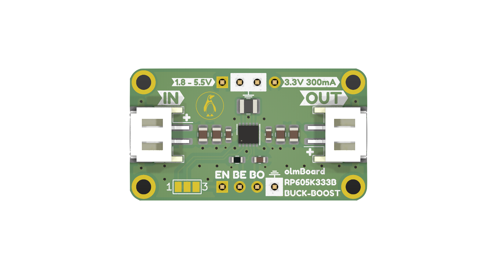

# olmBoard RP605K333B Buck-Boost Converter Module

Introducing our compact and ultra-low-power Buck-Boost Converter Module, designed using the high-performance RP605K333B DC/DC converter IC. This versatile module is perfect for powering a wide range of electronic devices, providing a stable 3.3V output (up to 300mA) from varying input sources ranging from 1.8V to 5.5V. This nifty little IC also features built-in Battery Monitor (BM) circuitry that, when enabled, divides the input voltage (VIN/3) and directly provides a buffered voltage to be measured by the ADC. These readings can be used to estimate the state of a battery.

Some specs: 

- Operating quiescent current: **~300 nA**
- Input voltage range (VIN):*** 1.8 V to 5.5 V***
- Output current: up to** 300 mA**
- Output Voltage: **3.3V**
- Output Voltage Accuracy: **±1.5%**
- Efficiency: **~90%** in buck mode, **~75%** in boost mode
- Shutdown current: **0.01 μA**
- Output DC/DC auto-discharge is included
- Battery monitor: **VIN/3** typ. **0.1 μA** extra supply current
- Operating Temperature:** −40 to 85 °C**
- Module dimensions: **19.3 mm x 34.5 mm (0.76 in. x 1.36 in.)** with 4x M2 mounting holes

This DC/DC converter IC offers some unique features such as Variable Frequency Modulation (VFM) and built-in battery monitoring circuit with only 100 nA supply current. The module is breadboard friendly and all of the pins are broken out for easy interfacing. Additionally, there are two JST-PH connectors on input and output for easy battery and device connections.

### License:
- Hardware license: CERN-OHL-S v2
- Documentation license:  CC BY-SA 4.0 International.

### Contact:
If you have any question or comments please feel free to open an issue (or a discussion or drop me a message at [@makertronika](https://twitter.com/makertronika). 
